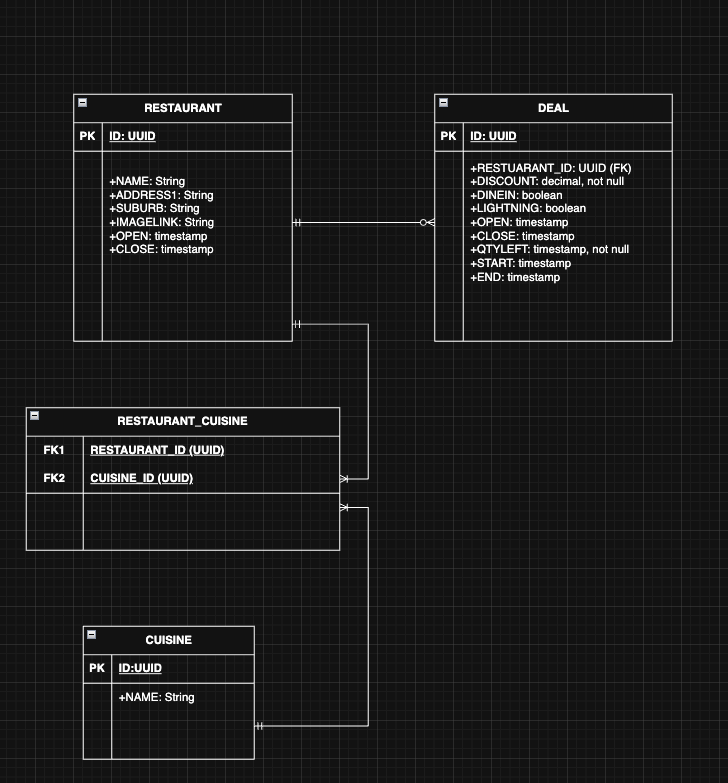

## EatClub coding challenge

This project was created as Amila Chandrasiri's submission to EatClub coding challenge.

Coding challenge can be found at the project root level
here: [EatClub Tech Challenge](./EatClub%20Tech%20Challenge%20-%20Java%20AWS%20-%20v2.pdf)

## How to run
- Clone repo
- Open a terminal at repo root
- run `./mvnw clean install spring-boot:run` (assuming unix terminal)
- Task 1:
  - run `curl http://localhost:8080/api/active-deals?timeOfDay={time}` where `{time}` is in `h:mma` format
- Task 2:
  - run `curl http://localhost:8080/api/peak-time-window`

### Bonus tasks
Database recommendation: Relational database schema with AWS Aurora (PostgreSQL)

Reasoning:
- The structure of data could be effectively presented in a relational manner (A restaurant can have many Deals etc.)
- Cuisines can be normalised in to its own entity with a many-to-many relation with Restaurant entity
- This relational model will allow fast and efficient queries (given appropriate indexes for a business case are used)
    on what I can assume as reasonable use cases, such as:
  - Deals in a suburb
  - Filter by Cuisine
  - Max discount deals and offering restaurants
  - Deal available times (via appropriate indexing)
- Use of Postgres on Aurora gives us:
  - Advantages of being a AWS managed DB (availability, maintenance, backups etc)
  - Option of using binary json storage format like Jsonb should the need arise to store extensible 
    NoSQL like data (cuisines etc.)
  - Ability to tune cost/performance for real world needs without downtime

Note: above is presented without knowledge of how this data will be stored/queried in a production system,  
recommendations may need revision depending on use case.

ER diagram for the database

## Assumptions and implementation notes

- Project is written in Java targeting v21
- GraalVM plugin is enabled but not used just because I wanted to mess around with its functionality
- Project uses embedded Netty server
- Project is dockerised but disabled
- Basic spring security is configured, and all requests are authenticated against a single admin
    user specified in [App config file](./src/main/resources/application.properties)
- if a deal doesn't have start/end times, it is assumed the deal is available throughout the
    restaurant opening hours
- Deal open/close times are calculated according to following logic
    deal start -> deal open -> restaurant open
    deal end -> deal close -> restaurant close
- Deals with less than 1 qty available are excluded
- No security implementation is included with this exercise, the APIs are openly accessible
- If there are no restaurants available, the responses will be null
- Assuming time format to be "h:mma"

### Tools and AI usage
- Tools such as Intellij code generation and auto-completion have been used
- AI assistant usage was limited to test case and test data generation only, primary logic was written by hand 
    using web, library and API references 